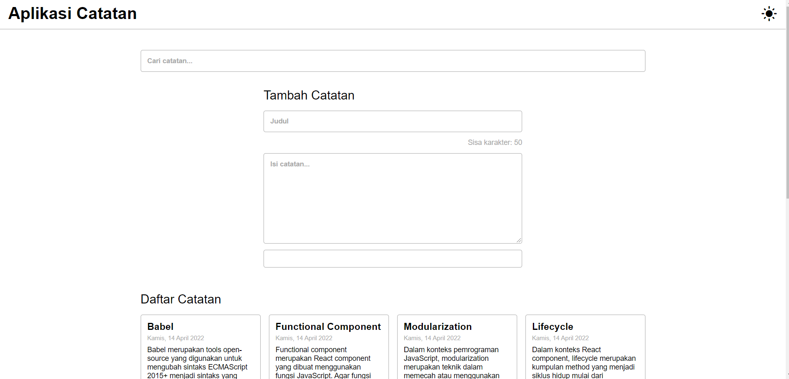
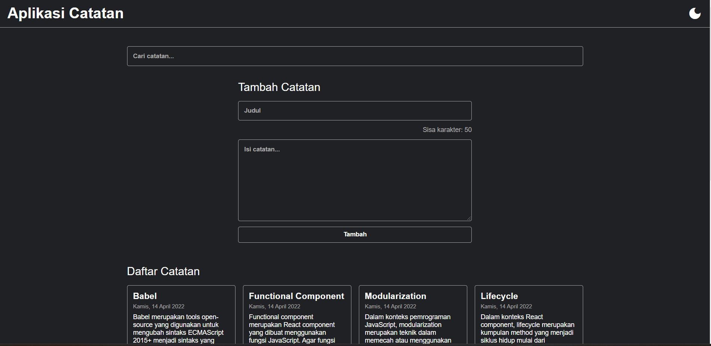

# 📓 Personal Notes App

 
 


A simple and elegant note-taking application built with **React** and **Vite**. The app allows users to create, view, archive, and delete notes, with a dark mode feature for better usability.

---

## 🌟 Features
- 📝 **Add Notes**: Create and manage personal notes easily.
- 🗑️ **Delete Notes**: Remove unwanted notes.
- 📁 **Archive Notes**: Archive notes for better organization.
- 🔍 **Search**: Search for notes by title.
- 🌙 **Dark Mode**: Switch between light and dark themes.
- 🔔 **Responsive Design**: Fully optimized for desktop and mobile.

---

## 🖥️ Technologies Used
- **React** (with JSX)
- **Vite** (fast build tool)
- **CSS** (custom styling)
- **JavaScript (ES6)**

---

## 📦 Installation

Follow these steps to set up the project locally:

1. **Clone the Repository**
   ```bash
   git clone https://github.com/RizqiJagad/personal-notes-app.git

2. **Navigate to the Project Directory**
    ```bash
    cd personal-notes-app

3. **Install Dependencies**
    npm install

4. **Start the Development Server**
    npm run dev

5. **Open your browser and navigate to http://localhost:5173.**

---

## 🚀 Deployment
This project is ready to be deployed. You can use platforms like:

- **Netlify**
- **Vercel**
- **GitHub Pages**

---

## 📸 Screenshots
Light Mode:



Dark Mode :



## 📜 License

This project is licensed under the MIT License.

## 🙌 Acknowledgements
Special thanks to:

React: For an amazing JavaScript library.
Vite: For a blazing fast development environment.
Shields.io: For the awesome badges.
And everyone who supports this project!